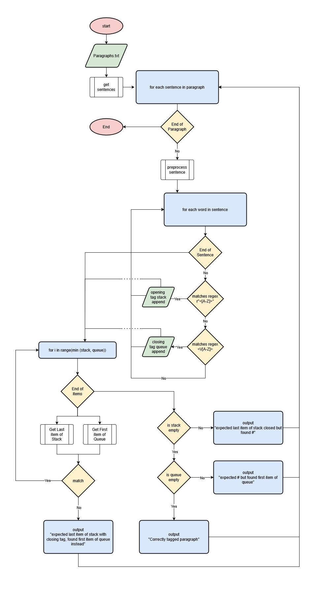

## How to Run TagChecker

<h6>To run TagChecker, please clone this repo into your local machine.
You do not need any external libraries as I have used builtin libraries like re and collections.

After which, please modify or replace Paragraph.txt with your Sample and run TagChecker.py. You can do so by
1. running 
```python
py TagChecker.py 
```
through the CLI - <b>Recommended</b>

2. running 
```python 
py TagChecker.py
```
on your favourite IDE

Please feel free to go through the <b>commmit history</b> to explore my thought process and how I solved
this given task.

Note: I have also included Test.py that was seperated from TagChecker.py for easy testing, and made it modular with HelperFunctions.py</h6>

## Methodology Diagram of Tag Checker

